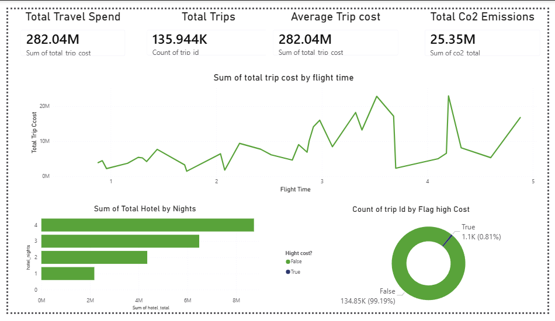
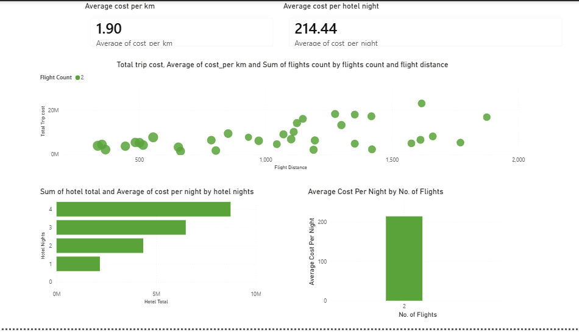
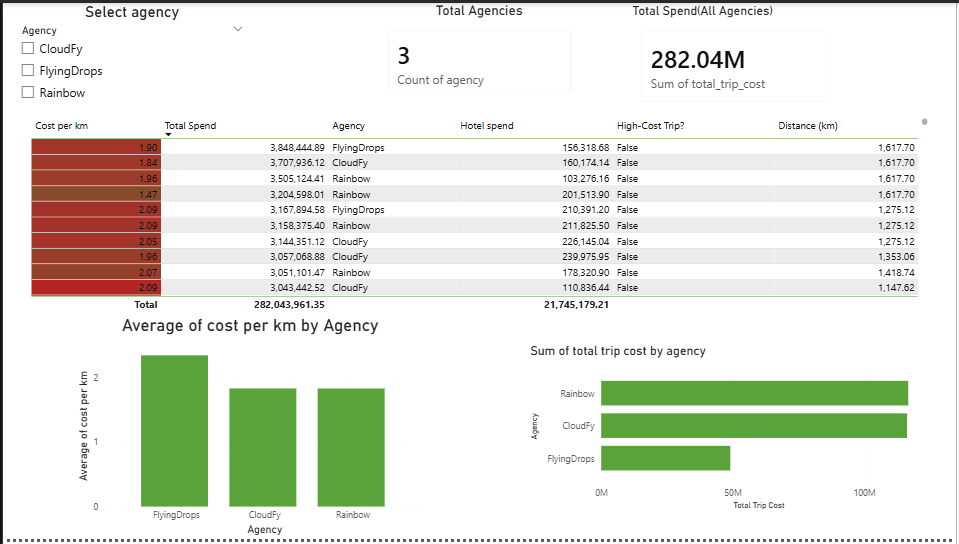

# 🌍 Travel Procurement Analytics Dashboard  
### End-to-End Travel Spend, Supplier Performance & CO₂ Insights

This project delivers a complete travel procurement analytics solution using **Python** and **Power BI**, designed to replicate the analytical responsibilities of an **Assistant Category Manager (Travel)** at a global company such as **Maersk**.

The dashboard analyzes travel spend, supplier efficiency, cost drivers, and sustainability metrics to support strategic sourcing and informed decision-making.

---

# Project Overview

This project covers the entire analytics lifecycle:

### **1. Data Engineering (Python)**
- Processed and cleaned **270,000+ travel records**
- Merged three datasets: flights, hotels, and users
- Created trip-level metrics and factors for procurement insights

### **2. Feature Engineering**
Custom metrics generated include:
- `total_trip_cost`  
- `cost_per_km`  
- `cost_per_night`  
- `cost_per_flight`  
- `trip_duration`  
- `co2_flight`, `co2_hotel`, `co2_total`  
- `flag_high_cost` using z-score anomaly detection  
- Supplier KPIs  

### **3. Business Intelligence (Power BI)**
A three-page interactive dashboard designed for procurement decision-makers:
1. **Travel Cost & Efficiency Overview**  
2. **Supplier / Agency Performance**  
3. **Cost Drivers & CO₂ Footprint Analysis**

---

# Key Insights From the Dashboard

### ⭐ 1. Supplier Efficiency Varies Significantly
- Some agencies deliver far better cost-per-km than others  
- Certain agencies consistently generate **high-cost trips**  
- Opportunity for preferred supplier consolidation  

### ⭐ 2. Spend Concentration
- Majority of travel spend is controlled by few providers  
- High-leverage opportunity for negotiation with top suppliers  

### ⭐ 3. High-Cost Trip Detection
- Outliers linked to:
  - Long-distance flights  
  - Late bookings  
  - Specific supplier patterns  

### ⭐ 4. Clear Cost Drivers
- Strong correlation between **distance** and spend  
- Hotel nights significantly affect total trip cost  
- Cost per night varies widely between destinations  

### ⭐ 5. CO₂ Impact
- CO₂ emissions strongly correlate with trip length  
- Certain trip types and agencies create disproportionately high CO₂  
- Supports emissions-reduction strategy  

---

# 📊 Dashboard Pages

### **1. Travel Cost & Efficiency Overview**

---

### **2. Supplier / Agency Performance**

---

### **3. Cost Efficiency & Trip Drivers**

---

# 🔧 Tech Stack

### **Python**
- Pandas  
- NumPy  
- CO₂ estimation  
- Outlier detection  
- Data cleaning  

### **Power BI**
- Data modelling  
- DAX calculations  
- KPI cards  
- Supplier analytics  
- Trend analysis  
- Conditional formatting  

### **GitHub Pages**
- Portfolio website  
- Project documentation  

---

# 📁 Project Structure
travel-procurement-dashboard/
│
├── data/ # Raw & sample datasets
├── notebooks/ # Data preparation notebook
├── powerbi/ # PBIX dashboard file (sample sized)
├── images/ # Dashboard screenshots
├── website/ # GitHub Pages (index.md)
└── README.md # You're reading it

---

# 🎯 Why This Project Fits a Travel Category Management Role

The project demonstrates:

✔ Supplier insight generation  
✔ Travel spend optimization  
✔ Risk & anomaly detection  
✔ CO₂ / sustainability reporting  
✔ Stakeholder-ready dashboards  
✔ Multi-dataset modelling (flights, hotels, users)  
✔ Problem-solving approach aligned with real procurement workflows  

This matches the responsibilities of roles such as:

- Assistant Category Manager (Travel)  
- Procurement Analyst  
- Travel Category Specialist  
- Indirect Procurement Analyst  

---

# 🔗 Live Website  
View the full portfolio website here:  
👉 **https://Amin-Azad.github.io/travel-procurement-dashboard**

---

